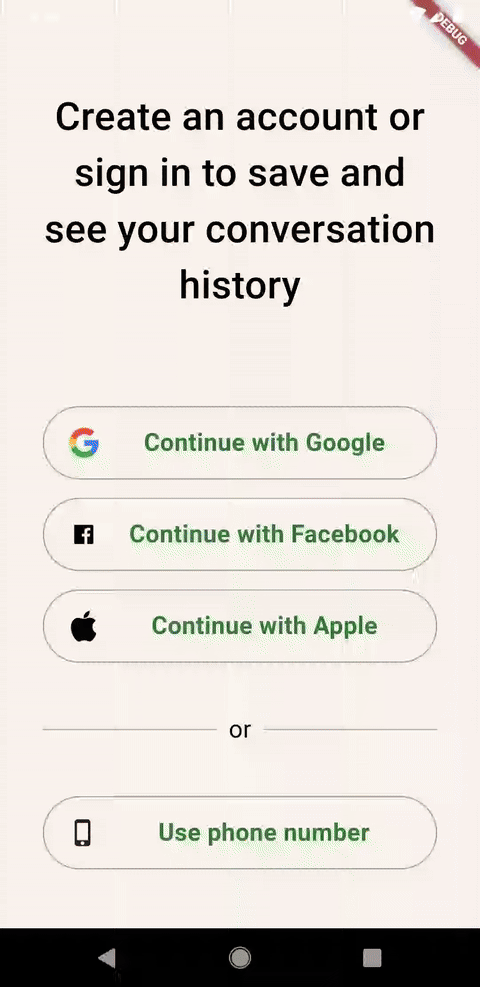

# 📱 Social Login App

[](https://flutter.dev/)
[](https://firebase.google.com/)
[](https://mobx.netlify.app/)
[](https://dart.dev/)

🇧🇷 Leia isto em [Português](README.md)

> Flutter application focused on **social authentication (Google & Facebook)** integrated with **Firebase Authentication**, featuring reactive state management powered by **MobX** and a decoupled architecture built with **GetIt**.

## 📝 About the Project

**Social Login App** is a application developed in **Flutter** designed to demonstrate in practice the integration of **social authentication** (Google Sign-In and Facebook Auth) using **Firebase Authentication**.

The project was designed following a clean and decoupled architecture within the Flutter ecosystem, highlighted by:
- **Reactive State Management** decoupled with **MobX**.
- **Dependency Injection** modularized with **GetIt**.
- **Dynamic Navigation** through a profile shell with a Navigation Drawer.
- **Routing & Session Validation** reactively handled via a **Splash** screen.
- **Push Notifications** prepared using **Firebase Cloud Messaging (FCM)** and `flutter_local_notifications`.

## 🖼️ App Preview

Below is a visual demonstration of the running application, showcasing the social login flow and navigation between screens:



## ✨ Features

- 🔑 **Google Sign-In:** Fast and secure authentication integrated with the Google Sign-In SDK.
- 📘 **Facebook Login:** Full support for social authentication via Facebook Auth.
- 🔥 **Firebase Authentication:** Centralized user session management (`firebase_auth`).
- ⚡ **Reactive State Management (MobX):** Precise control of loading states, error handling, and real-time UI updates.
- 📌 **Dependency Injection (GetIt):** Service Locator for decoupled management of instances such as notification and authentication services.
- 🖼️ **Dynamic Navigation (Drawer):** Profile interface (`ProfilePage`) with a Side Menu (`CustomDrawer`) allowing switching between Favorites, Messages, Settings, and About.
- 🔄 **Active Session Redirection:** Splash screen that continuously inspects session status and automatically redirects logged-in users.
- 🔔 **Push Notifications (FCM):** Infrastructure ready to receive background notifications and display local alerts (`NotificationService`).

## 🛠️ Technologies and Packages Used

| Technology | Description / Role in Project |
| :--- | :--- |
| **Flutter (SDK)** | UI framework for cross-platform mobile development. |
| **Firebase Auth** | Authentication service and user management. |
| **Google Sign-In** | Authentication via Google account (`google_sign_in`). |
| **Flutter Facebook Auth** | Authentication via Facebook (`flutter_facebook_auth`). |
| **MobX / Flutter MobX** | Reactive state management based on observables and actions. |
| **GetIt** | Service Locator for dependency injection. |
| **Firebase Messaging & Local Notifications** | Receiving and managing Push Notifications (FCM). |
| **Build Runner & MobX Codegen** | Code generation tool for `.g.dart` files. |

## 📂 Project Structure

```text
lib/
├── firebase_options.dart      # Configurations generated by Firebase CLI
├── locator.dart               # Dependency registration (GetIt)
├── main.dart                  # Application entry point
├── pages/
│   ├── about.page.dart        # "About" screen
│   ├── favorites.page.dart    # "Favorites" screen
│   ├── messages.page.dart     # "Messages" screen
│   ├── profile.page.dart      # Profile Screen (Main Shell + Drawer)
│   ├── settings.page.dart     # "Settings" screen
│   ├── splash_screen.page.dart# Splash screen with session validation
│   └── login/
│       ├── login.page.dart    # Social Login Interface
│       └── store/
│           ├── login_store.dart   # Business logic and state (MobX)
│           └── login_store.g.dart # MobX generated code
├── services/
│   └── notification_service.dart # Push Notification Manager (FCM)
└── widgets/
    └── custom_drawer.widget.dart # Reusable Side Menu component
```

## 🚀 How to Run the Project

### 1. Prerequisites
- **Flutter SDK** installed on your machine (`^3.10.7` or higher).
- Active Android/iOS emulator or connected physical device.
- **Firebase** setup:
  - `google-services.json` file added in `android/app/`.
  - `GoogleService-Info.plist` file added in `ios/Runner/`.
  - Package visibility declarations (`<queries>`) in `AndroidManifest.xml` for Android 11+ (API 30+) compatibility.

### 2. Clone and Install Dependencies
In your terminal, navigate to the project root and run:

```bash
flutter pub get
```

### 3. Generate MobX Files (Build Runner)
Since the project uses MobX, generate the compiled `.g.dart` files:

```bash
flutter pub run build_runner build --delete-conflicting-outputs
```

### 4. Run the Application
```bash
flutter run
```

## 📄 License

Project developed for educational and demonstration purposes.
