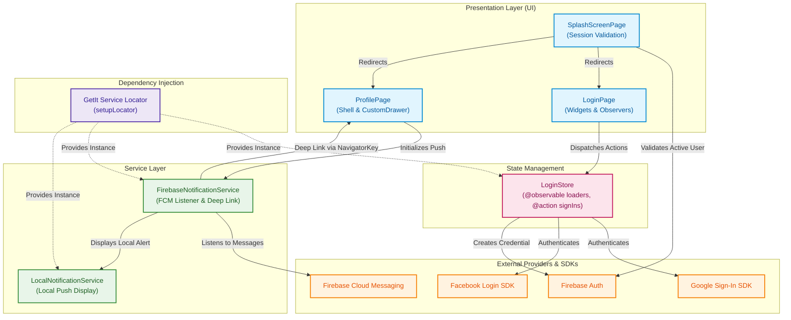

# 📱 App Social Login

[](https://flutter.dev/)
[](https://dart.dev/)
[](https://firebase.google.com/)
[](https://firebase.google.com/)
[](https://pub.dev/packages/mobx)
[](https://pub.dev/packages/get_it)

> 🇧🇷 [**Português**](README.md) | 🇺🇸 **English Version**

A Flutter mobile application demonstrating practical integration of **social authentication (Google Sign-In and Facebook Login)** with the **Firebase Authentication** ecosystem, reactive state management using **MobX**, dependency injection with **GetIt**, and foreground/background **Push Notifications** handling with deep link route redirection.

## 📌 Quick Navigation

- [📝 About the Project](#-about-the-project)
- [🖼️ Preview](#️-preview)
- [✨ Features](#-features)
- [🛠️ Technologies and Tools Used](#️-technologies-and-tools-used)
- [🏛️ Solution Architecture](#️-solution-architecture)
- [📁 Repository Structure](#-repository-structure)
- [💡 Technical Decisions](#-technical-decisions)
- [🚀 How to Run the Project](#-how-to-run-the-project)

## 📝 About the Project

**App Social Login** is a mobile solution built with **Flutter** designed to serve as a clean reference for multi-provider OAuth authentication (Google and Facebook) integrated into Firebase Authentication.

Beyond the complete authentication lifecycle (Sign-In, Session Validation, and Safe Multi-Provider Sign-Out), the app features decoupled state management with MobX and a push notification handling pipeline using **Firebase Cloud Messaging (FCM)** and **Flutter Local Notifications**, enabling targeted contextual navigation triggered by remote notification clicks.

## 🖼️ Preview


## ✨ Features

- 🔑 **Google Sign-In:** Authentication using Google Sign-In SDK integrated into Firebase (`OAuthCredential`).
- 📘 **Facebook Login:** Social sign-in via Facebook SDK (`flutter_facebook_auth`) fetching secure access credentials.
- 🔥 **Firebase Authentication:** Session centralization, account unification, and native auth token persistence.
- ⚡ **Reactive State Management (MobX):** Independent button loader control and immediate action feedback.
- 💉 **Dependency Injection (GetIt):** Service Locator registering Stores and Services via lazy singletons.
- 🧭 **Session Verification & Routing:** Reactive `SplashScreen` validating Firebase's `currentUser` to route to the correct screen.
- 🚪 **Multi-Provider Safe Sign-Out:** Explicit cleanup of sessions in both Firebase and native SDKs (Google & Facebook).
- 🔔 **Push Notifications with Deep Links:** Foreground/background message reception with local pop-up display and deep linking to Messages and Settings pages.

## 🛠️ Technologies and Tools Used

| Layer / Purpose | Technology | Description |
| :--- | :--- | :--- |
| **Primary Language** | **Dart 3.10+** | Strictly typed language with sound null-safety and modern concurrency features |
| **Mobile Framework** | **Flutter 3.10+** | Declarative cross-platform UI toolkit delivering native-grade performance |
| **Authentication & Backend** | **Firebase Authentication 6.5.1** | Centralized user management and OAuth identity provider integration |
| **Google Social Login** | **Google Sign-In 7.2.0** | Native OAuth authentication flow for Google accounts |
| **Facebook Social Login** | **Flutter Facebook Auth 7.1.6** | Facebook SDK integration for seamless native login |
| **State Management** | **MobX 2.6.0 / Flutter MobX 2.3.0** | Transparent reactive state management using Observables and Actions |
| **Dependency Injection** | **GetIt 9.2.1** | Lightweight and performant Service Locator for decoupled component architecture |
| **Push Notifications** | **Firebase Messaging 16.2.2** | Reception of remote push messages in foreground and background states |
| **Local Notifications** | **Flutter Local Notifications 21.0.0** | Native device alert display for incoming messages |
| **Code Generation** | **Build Runner & MobX Codegen** | Automated code generation of `.g.dart` reactive stores |

## 🏛️ Solution Architecture



## 📁 Repository Structure

```text
app_social_login/
├── android/                          # Native Android configuration (Manifest, Gradle)
├── assets/
│   └── images/                       # Provider logos and demonstration preview gif
├── ios/                              # Native iOS configuration (Info.plist, Pods)
├── lib/
│   ├── firebase_options.dart         # Auto-generated Firebase CLI configuration
│   ├── locator.dart                  # GetIt Service Locator configuration
│   ├── main.dart                     # Application root, theme setup, and global navigator key
│   ├── pages/                        # Screen layouts and UI pages
│   │   ├── about.page.dart           # Informative "About" page
│   │   ├── favorites.page.dart       # Favorites page
│   │   ├── messages.page.dart        # Messages page (target for push deep links)
│   │   ├── profile.page.dart         # Profile page (Main shell with Navigation Drawer)
│   │   ├── settings.page.dart        # Settings page (target for push deep links)
│   │   ├── splash_screen.page.dart   # Splash screen with reactive session checking
│   │   └── login/                    # Authentication Module
│   │       ├── login.page.dart       # Social login provider interface
│   │       ├── store/
│   │       │   ├── login.store.dart  # MobX store with authentication logic
│   │       │   └── login.store.g.dart# Generated reactive code by build_runner
│   │       └── widgets/
│   │           └── login_button.widget.dart # Reusable button supporting loading states
│   ├── services/                     # Helper services and third-party integrations
│   │   ├── firebase_notification.service.dart # FCM listener and deep link routing
│   │   └── local_notification.service.dart    # Native local notification display
│   └── widgets/                      # Reusable shared components
│       └── custom_drawer.widget.dart # Dynamic side drawer displaying user credentials
└── pubspec.yaml                      # Project dependencies and configuration
```

## 💡 Technical Decisions

- **Isolated MobX Observables:** Independent reactive flags (`_isGoogleLoading` and `_isFacebookLoading`) give targeted visual feedback per provider button clicked without locking the whole UI generically.
- **Service Locator with GetIt:** Centralizes instantiations for stores and services without tightly coupling them to widget contexts, promoting cleaner separation and easier mocking.
- **Resilient Multi-Provider Sign-Out:** The `signOut()` action inspects the active user's `providerData` list to explicitly log out from Google's and Facebook's native SDKs before calling Firebase Auth sign-out, avoiding unintended silent re-authentication.
- **Global Routing with GlobalKey:** A `globalNavigatorKey` allows the notification services to execute routing changes cleanly even when initiated by background or system notification click events.
- **Foreground Notification Fallback:** Since FCM does not present visual pop-up banners when the app is in the foreground by default, `LocalNotificationService` catches incoming payloads and triggers an immediate local notification.

## 🚀 How to Run the Project

### 1. Prerequisites
- **Flutter SDK** (`^3.10.7` or higher) configured in your system path.
- **Java JDK** (version 17 recommended for Android builds).
- Active Android/iOS emulator or connected physical device.
- Configured project in **Firebase Console**:
  - `google-services.json` inside `android/app/`
  - `GoogleService-Info.plist` inside `ios/Runner/`

### 2. Install Dependencies
Clone the repository and install packages:

```bash
flutter pub get
```

### 3. Generate MobX Files
Generate the `.g.dart` store files:

```bash
dart run build_runner build --delete-conflicting-outputs
```

### 4. Run the Application
Launch the app on your connected device:

```bash
flutter run
```

<div align="center">
  Developed by <strong>Ludson Pereira dos Santos</strong> 🚀<br />
  <a href="https://www.linkedin.com/in/ludson96/">LinkedIn</a> • <a href="https://github.com/ludson96">GitHub</a> • <a href="mailto:ludson_ps27@hotmail.com">E-mail</a>
</div>
