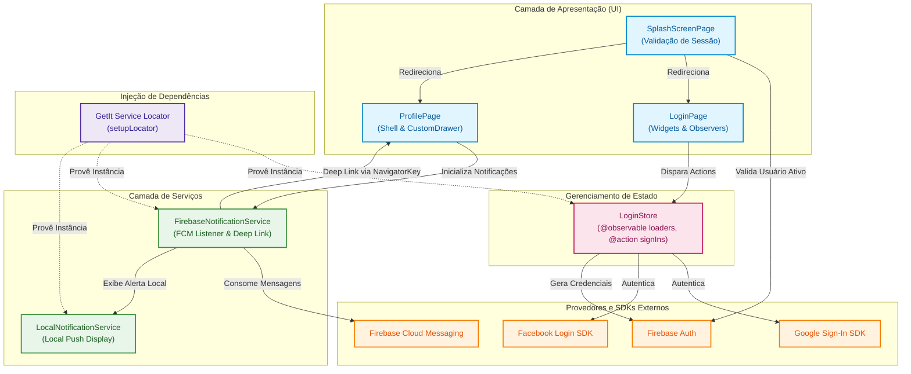

# 📱 App Social Login

[](https://flutter.dev/)
[](https://dart.dev/)
[](https://firebase.google.com/)
[](https://firebase.google.com/)
[](https://pub.dev/packages/mobx)
[](https://pub.dev/packages/get_it)

> 🇧🇷 **Português** | 🇺🇸 [**English Version**](README.en.md)

Aplicativo Flutter demonstrando na prática a integração de **autenticação social (Google Sign-In e Facebook Login)** com o ecossistema **Firebase Authentication**, gerenciamento de estado reativo via **MobX**, injeção de dependências com **GetIt** e tratamento de **Push Notifications** em primeiro e segundo plano com redirecionamento de rotas.

## 📌 Navegação Rápida

- [📝 Sobre o Projeto](#-sobre-o-projeto)
- [🖼️ Preview](#️-preview)
- [✨ Funcionalidades](#-funcionalidades)
- [🛠️ Tecnologias e Ferramentas Utilizadas](#️-tecnologias-e-ferramentas-utilizadas)
- [🏛️ Arquitetura da Solução](#️-arquitetura-da-solução)
- [📁 Estrutura do Repositório](#-estrutura-do-repositório)
- [💡 Decisões Técnicas](#-decisões-técnicas)
- [🚀 Como Executar o Projeto](#-como-executar-o-projeto)

## 📝 Sobre o Projeto

O **App Social Login** é uma solução mobile desenvolvida em **Flutter** criada para servir como referência em autenticação com múltiplos provedores OAuth (Google e Facebook) integrada ao Firebase Authentication.

Além do ciclo de autenticação completo (Login, Validação de Sessão e Logout seguro por provedor), o app conta com gerenciamento de estado desacoplado com MobX e um pipeline de notificações com **Firebase Cloud Messaging (FCM)** e **Flutter Local Notifications**, permitindo acionar navegação contextual direcionada a partir do clique em notificações remotas.

## 🖼️ Preview


## ✨ Funcionalidades

- 🔑 **Login com Google:** Autenticação via Google Sign-In SDK integrada ao Firebase (`OAuthCredential`).
- 📘 **Login com Facebook:** Autenticação via Facebook SDK (`flutter_facebook_auth`) com obtenção de credenciais seguras.
- 🔥 **Firebase Authentication:** Centralização da sessão, unificação de usuário e persistência nativa de autenticação.
- ⚡ **Gerenciamento de Estado Reativo (MobX):** Controle de loaders independentes para cada botão de login e feedback imediato de ações.
- 💉 **Injeção de Dependências (GetIt):** Service Locator registrando Stores e Services com carregamento preguiçoso (*lazy singletons*).
- 🧭 **Verificação e Roteamento de Sessão:** `SplashScreen` reativa que valida o `currentUser` do Firebase e direciona para a tela correta.
- 🚪 **Logout Seguro por Provedor:** Limpeza explícita da sessão tanto no Firebase quanto no SDK nativo de cada provedor autenticado.
- 🔔 **Notificações Push com Deep Link:** Recepção em foreground/background com exibição local e roteamento dinâmico para páginas de Mensagens ou Configurações.

## 🛠️ Tecnologias e Ferramentas Utilizadas

| Camada / Finalidade | Tecnologia | Descrição |
| :--- | :--- | :--- |
| **Linguagem Principal** | **Dart 3.10+** | Linguagem tipada com suporte a null-safety e recursos modernos de concorrência |
| **Framework Mobile** | **Flutter 3.10+** | Framework declarativo multiplataforma para alta performance nativa |
| **Autenticação & Backend** | **Firebase Authentication 6.5.1** | Gestão centralizada de usuários e provedores de identidade OAuth |
| **Login Social Google** | **Google Sign-In 7.2.0** | Fluxo de autenticação nativa com contas Google |
| **Login Social Facebook** | **Flutter Facebook Auth 7.1.6** | SDK de autenticação com integração nativa ao Facebook App |
| **Gerenciamento de Estado** | **MobX 2.6.0 / Flutter MobX 2.3.0** | Gerenciamento de estado reativo transparente via Observables e Actions |
| **Injeção de Dependências** | **GetIt 9.2.1** | Service Locator simples e performático para desacoplamento de classes |
| **Notificações Push** | **Firebase Messaging 16.2.2** | Recepção de mensagens e push notifications em primeiro/segundo plano |
| **Notificações Locais** | **Flutter Local Notifications 21.0.0** | Exibição visual de notificações nativas no dispositivo |
| **Geração de Código** | **Build Runner & MobX Codegen** | Geração automática do código reativo `.g.dart` |

## 🏛️ Arquitetura da Solução



## 📁 Estrutura do Repositório

```text
app_social_login/
├── android/                          # Configurações nativas Android (Manifest, Gradle)
├── assets/
│   └── images/                       # Ícones de provedores e gif de demonstração
├── ios/                              # Configurações nativas iOS (Info.plist, Pods)
├── lib/
│   ├── firebase_options.dart         # Configuração gerada do Firebase CLI
│   ├── locator.dart                  # Configuração do GetIt (Service Locator)
│   ├── main.dart                     # Inicialização do app, tema e GlobalKey de navegação
│   ├── pages/                        # Telas e interfaces da aplicação
│   │   ├── about.page.dart           # Página Informativa "Sobre"
│   │   ├── favorites.page.dart       # Página de Favoritos
│   │   ├── messages.page.dart        # Página de Mensagens (alvo de push notification)
│   │   ├── profile.page.dart         # Página de Perfil (Shell com Drawer)
│   │   ├── settings.page.dart        # Página de Configurações (alvo de push notification)
│   │   ├── splash_screen.page.dart   # Splash com validação reativa de sessão
│   │   └── login/                    # Módulo de Autenticação
│   │       ├── login.page.dart       # Interface com botões de provedores
│   │       ├── store/
│   │       │   ├── login.store.dart  # Store do MobX com lógica de autenticação
│   │       │   └── login.store.g.dart# Código gerado pelo build_runner
│   │       └── widgets/
│   │           └── login_button.widget.dart # Botão customizado com suporte a loading
│   ├── services/                     # Serviços auxiliares e integrações
│   │   ├── firebase_notification.service.dart # Listener FCM e roteamento de deep links
│   │   └── local_notification.service.dart    # Exibição de notificações locais
│   └── widgets/                      # Componentes reutilizáveis
│       └── custom_drawer.widget.dart # Menu lateral dinâmico com dados do usuário
└── pubspec.yaml                      # Dependências e metadados do projeto
```

## 💡 Decisões Técnicas

- **Separação com MobX e Observables Isolados:** Foram criadas variáveis reativas específicas para cada botão (`_isGoogleLoading` e `_isFacebookLoading`), garantindo que o usuário receba feedback visual do botão específico clicado sem bloquear o restante da tela de maneira genérica.
- **Service Locator com GetIt:** O uso do GetIt centraliza a criação e o acesso a instâncias de serviços e stores sem acoplamento direto com a árvore de widgets, facilitando testes e modularização.
- **Logout Completo e Resiliente:** A função de `signOut()` itera pelos provedores vinculados ao usuário autenticado (`user.providerData`) para deslogar explicitamente do SDK do Google (`GoogleSignIn.signOut()`) e do Facebook (`FacebookAuth.logOut()`) antes de finalizar no Firebase Auth, prevenindo login silencioso indesejado com conta antiga.
- **Navegação Global via GlobalKey:** Utilização de `globalNavigatorKey` para permitir que o serviço de push notification execute transições de rota mesmo quando a ação é disparada por eventos externos (FCM background / payload tap).
- **Tratamento de Notificações em Foreground:** Como o FCM não exibe pop-up nativo com app aberto por padrão, o `LocalNotificationService` intercepta as mensagens em foreground e emite um alerta local imediato.

## 🚀 Como Executar o Projeto

### 1. Pré-requisitos
- **Flutter SDK** (`^3.10.7` ou superior) configurado no path.
- **Java JDK** (versão 17 recomendada para compilação Android).
- Dispositivo físico ou emulador Android/iOS configurado.
- Projeto configurado no **Firebase Console**:
  - `google-services.json` em `android/app/`
  - `GoogleService-Info.plist` em `ios/Runner/`

### 2. Instalação de Dependências
Clone o repositório e baixe os pacotes:

```bash
flutter pub get
```

### 3. Geração de Código MobX
Gere os arquivos `.g.dart` das stores:

```bash
dart run build_runner build --delete-conflicting-outputs
```

### 4. Execução do Aplicativo
Inicie o app no dispositivo conectado:

```bash
flutter run
```

<div align="center">
  Desenvolvido por <strong>Ludson Pereira dos Santos</strong> 🚀<br />
  <a href="https://www.linkedin.com/in/ludson96/">LinkedIn</a> • <a href="https://github.com/ludson96">GitHub</a> • <a href="mailto:ludson_ps27@hotmail.com">E-mail</a>
</div>
