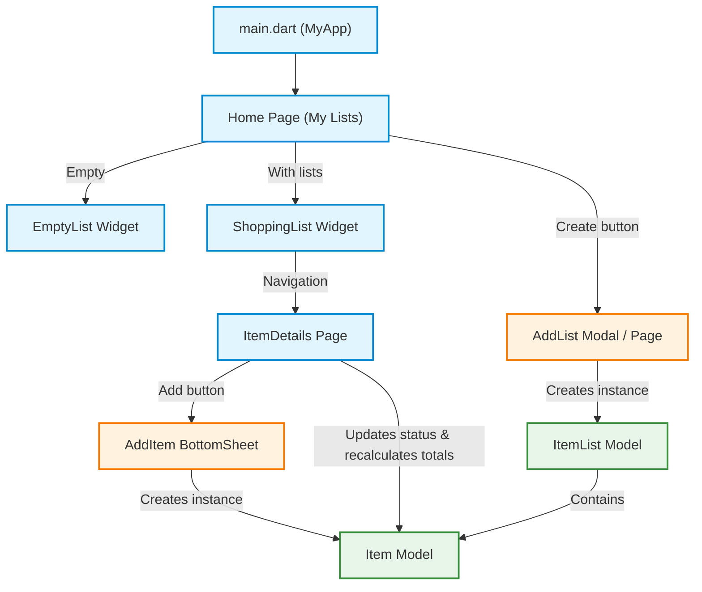

# 🛒 Shopping List App

[](https://flutter.dev/)
[](https://dart.dev/)
[](https://m3.material.io/)

> 🇧🇷 [**Português**](README.md) | 🇺🇸 **English Version**

Mobile application built with Flutter for creating, managing, and tracking shopping lists in a simple and intuitive way, featuring real-time financial expense calculations.

## 📌 Quick Navigation

- [📝 About the Project](#-about-the-project)
- [🖼️ Preview](#️-preview)
- [✨ Features](#-features)
- [🛠️ Technologies and Tools](#️-technologies-and-tools)
- [🏛️ Solution Architecture](#️-solution-architecture)
- [📁 Repository Structure](#-repository-structure)
- [💡 Technical Decisions](#-technical-decisions)
- [🚀 Getting Started](#-getting-started)

## 📝 About the Project

**Shopping List** is a Flutter application focused on productivity and personal shopping organization. The app allows users to create multiple themed lists (e.g., supermarket, market, hardware), add items with their respective monetary values, mark items already picked in the shopping cart, and track the financial balance between pending and purchased items in real time.

## 🖼️ Preview


## ✨ Features

- **Shopping List Creation**: Fast creation of custom lists via a dedicated screen.
- **Lists and Items Overview**: Clean UI featuring list cards and an empty state indicator.
- **Dynamic Item Addition**: Responsive modal bottom sheet with form field validations (name and price).
- **Cart Checkbox Toggle**: Interactive circular checkboxes that update item status and typography styling.
- **Real-time Financial Calculations**: Automatic totalizers calculating expenses for both **Unchecked** (pending) and **Checked** (purchased) items.
- **Dynamic Keyboard Handling**: Forms optimized with `viewInsets` handling to prevent virtual keyboard overlay.

## 🛠️ Technologies and Tools

| Layer / Purpose | Technology | Description |
| :--- | :--- | :--- |
| **Primary Language** | **Dart 3.10+** | Static typing, sound null safety, and functional collection methods |
| **Mobile Framework** | **Flutter 3.x** | Cross-platform development and native reactive rendering |
| **Design System** | **Material Design 3** | Modern UI components, custom themes, and consistent typography |
| **State Management** | **StatefulWidgets / setState** | Local reactive state and widget lifecycle control |
| **Icons & Assets** | **Cupertino Icons & Material Icons** | Native icon sets and asset bundle support |
| **Quality & Linting** | **flutter_lints 6.0.0** | Static analysis and standard code formatting rules |

## 🏛️ Solution Architecture



## 📁 Repository Structure

```text
lista_de_compras/
├── assets/
│   └── images/
│       ├── empty-list.png           # Empty state illustration
│       └── lista-compras-gif.gif    # Animated app demonstration
├── lib/
│   ├── main.dart                    # Application entry point and MaterialApp configuration
│   ├── model/
│   │   ├── item.model.dart          # Item data model (name, value, status)
│   │   └── item_list.model.dart     # Shopping list data model
│   ├── pages/
│   │   ├── home.page.dart           # Home screen displaying all created lists
│   │   └── item_details.page.dart   # Details screen managing items and total values
│   └── widgets/
│       ├── add_item.widget.dart     # Modal BottomSheet form to add a new item
│       ├── add_list.widget.dart     # Form screen to create a new list
│       ├── empty_list.widget.dart   # Informational placeholder widget for empty states
│       └── shopping_list.widget.dart# Component rendering the list items
├── pubspec.yaml                     # Dependencies, fonts, and assets configuration
└── README.md                        # Project documentation
```

## 💡 Technical Decisions

- **Modular Componentization**: Clean separation between data models (`model/`), full pages (`pages/`), and reusable components (`widgets/`), ensuring high maintainability.
- **Form Validation via FormState**: Utilization of `GlobalKey<FormState>` and `TextFormField` with declarative validation rules to prevent empty or invalid inputs.
- **Functional Data Processing**: Use of Dart's `where` and `fold` methods for efficient real-time calculation of monetary sums.
- **User Experience (UX)**: Integration of `ModalBottomSheet` for fast item insertion without losing the list context, along with `MediaQuery.of(context).viewInsets` for smooth keyboard transitions.

## 🚀 Getting Started

### Prerequisites
- [Flutter SDK](https://docs.flutter.dev/get-started/install) installed (version >= 3.10.7)
- Android Emulator, iOS Simulator, or connected physical device
- Recommended IDE: [VS Code](https://code.visualstudio.com/) or [Android Studio](https://developer.android.com/studio)

### Installation & Run

1. **Clone the repository:**
   ```bash
   git clone https://github.com/ludson96/mobile-w-flutter.git
   ```

2. **Navigate to the project directory:**
   ```bash
   cd mobile-w-flutter/4-formularios-e-navegacoes/lista_de_compras
   ```

3. **Install dependencies:**
   ```bash
   flutter pub get
   ```

4. **Run the app:**
   ```bash
   flutter run
   ```

<div align="center">
  Developed by <strong>Ludson Pereira dos Santos</strong> 🚀<br />
  <a href="https://www.linkedin.com/in/ludson96/">LinkedIn</a> • <a href="https://github.com/ludson96">GitHub</a> • <a href="mailto:ludson_ps27@hotmail.com">E-mail</a>
</div>
