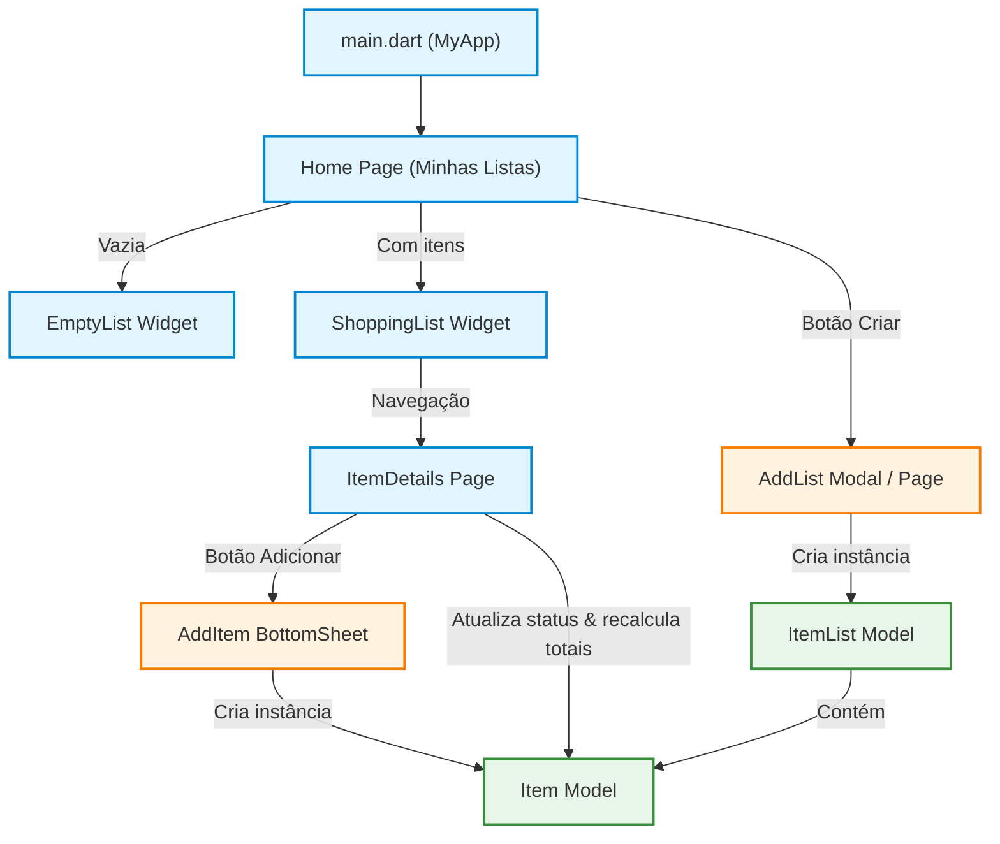

# 🛒 Lista de Compras App

[](https://flutter.dev/)
[](https://dart.dev/)
[](https://m3.material.io/)

> 🇧🇷 **Português** | 🇺🇸 [**English Version**](README.en.md)

Aplicativo mobile desenvolvido em Flutter para criação, gerenciamento e controle financeiro de listas de compras de forma simples e intuitiva, com cálculo automático de despesas em tempo real.

## 📌 Navegação Rápida

- [📝 Sobre o Projeto](#-sobre-o-projeto)
- [🖼️ Preview](#️-preview)
- [✨ Funcionalidades](#-funcionalidades)
- [🛠️ Tecnologias e Ferramentas Utilizadas](#️-tecnologias-e-ferramentas-utilizadas)
- [🏛️ Arquitetura da Solução](#️-arquitetura-da-solução)
- [📁 Estrutura do Repositório](#-estrutura-do-repositório)
- [💡 Decisões Técnicas](#-decisões-técnicas)
- [🚀 Como Executar o Projeto](#-como-executar-o-projeto)

## 📝 Sobre o Projeto

O **Lista de Compras** é uma aplicação Flutter focada em produtividade e organização pessoal no momento das compras. O app permite criar múltiplas listas temáticas (ex: supermercado, feira, materiais), adicionar itens com seus respectivos valores monetários, marcar produtos já colocados no carrinho e acompanhar em tempo real o balanço financeiro entre itens pendentes e itens adquiridos.

## 🖼️ Preview


## ✨ Funcionalidades

- **Criação de Listas de Compras**: Criação ágil de listas personalizadas em tela dedicada.
- **Visualização de Listas e Itens**: Interface limpa com cards de listas e indicador de estado vazio (*empty state*).
- **Adição Dinâmica de Itens**: Modal inferior (*BottomSheet*) responsivo com validação de campos (nome e valor).
- **Marcação de Produtos no Carrinho**: Checkbox circular interativo que atualiza o estado e estilo do item.
- **Cálculo Financeiro em Tempo Real**: Totalizadores automáticos que separam o valor dos itens **Não Marcados** (pendentes) e **Marcados** (adquiridos).
- **Ajuste Automático de Teclado**: Formulários com tratamento dinâmico de espaçamento para sobreposição de teclado virtual (`viewInsets`).

## 🛠️ Tecnologias e Ferramentas Utilizadas

| Camada / Finalidade | Tecnologia | Descrição |
| :--- | :--- | :--- |
| **Linguagem Principal** | **Dart 3.10+** | Tipagem estática, *sound null safety* e manipulações funcionais de coleções |
| **Framework Mobile** | **Flutter 3.x** | Desenvolvimento multiplataforma e reatividade nativa |
| **Design System** | **Material Design 3** | Componentes visuais modernos, temas customizados e tipografia consistente |
| **Gerenciamento de Estado** | **StatefulWidgets / setState** | Controle reativo local do ciclo de vida e estado dos widgets |
| **Ícones e Assets** | **Cupertino Icons & Material Icons** | Conjunto de ícones nativos e suporte a assets |
| **Qualidade e Padronização** | **flutter_lints 6.0.0** | Análise estática e regras de padronização do código |

## 🏛️ Arquitetura da Solução



## 📁 Estrutura do Repositório

```text
lista_de_compras/
├── assets/
│   └── images/
│       ├── empty-list.png           # Ilustração de estado vazio
│       └── lista-compras-gif.gif    # Demonstração animada da aplicação
├── lib/
│   ├── main.dart                    # Ponto de entrada e configuração do MaterialApp
│   ├── model/
│   │   ├── item.model.dart          # Modelo de dados de um item (nome, valor, status)
│   │   └── item_list.model.dart     # Modelo de dados da lista de compras
│   ├── pages/
│   │   ├── home.page.dart           # Tela principal com listagem das listas criadas
│   │   └── item_details.page.dart   # Tela de detalhes da lista e controle de itens/valores
│   └── widgets/
│       ├── add_item.widget.dart     # Modal BottomSheet com formulário para adicionar item
│       ├── add_list.widget.dart     # Tela de formulário para criação de nova lista
│       ├── empty_list.widget.dart   # Widget informativo para listas vazias
│       └── shopping_list.widget.dart# Componente de renderização das listas
├── pubspec.yaml                     # Dependências, fontes e assets do projeto
└── README.md                        # Documentação do projeto
```

## 💡 Decisões Técnicas

- **Componentização Modular**: Separação clara entre modelos de dados (`model/`), páginas de tela inteira (`pages/`) e componentes reutilizáveis (`widgets/`), garantindo manutenibilidade e clareza.
- **Validação com FormState**: Uso de `GlobalKey<FormState>` e `TextFormField` com validadores declarativos no modal de inserção de itens para evitar entradas vazias ou dados inconsistentes.
- **Manipulação Funcional de Dados**: Utilização dos métodos `where` e `fold` em Dart para agregar e calcular os valores monetários em tempo real com excelente desempenho e código conciso.
- **Experiência de Usuário (UX)**: Adoção de `ModalBottomSheet` para fluxo ágil de inclusão de itens sem perder o contexto visual da lista, combinado com compensação de teclado via `MediaQuery.of(context).viewInsets`.

## 🚀 Como Executar o Projeto

### Pré-requisitos
- [Flutter SDK](https://docs.flutter.dev/get-started/install) instalado (versão >= 3.10.7)
- Emulador Android / Simulador iOS ou dispositivo físico conectado
- Editor de código recomendado: [VS Code](https://code.visualstudio.com/) ou [Android Studio](https://developer.android.com/studio)

### Passo a Passo

1. **Clone o repositório:**
   ```bash
   git clone https://github.com/ludson96/mobile-w-flutter.git
   ```

2. **Acesse a pasta do projeto:**
   ```bash
   cd mobile-w-flutter/4-formularios-e-navegacoes/lista_de_compras
   ```

3. **Instale as dependências:**
   ```bash
   flutter pub get
   ```

4. **Execute o aplicativo:**
   ```bash
   flutter run
   ```

<div align="center">
  Desenvolvido por <strong>Ludson Pereira dos Santos</strong> 🚀<br />
  <a href="https://www.linkedin.com/in/ludson96/">LinkedIn</a> • <a href="https://github.com/ludson96">GitHub</a> • <a href="mailto:ludson_ps27@hotmail.com">E-mail</a>
</div>
