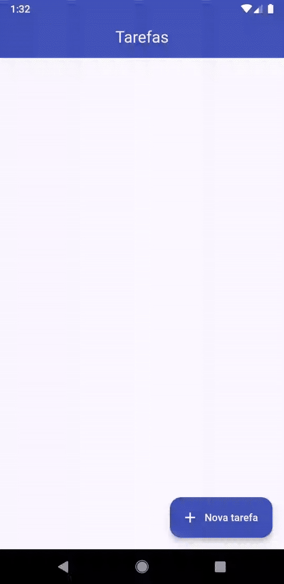
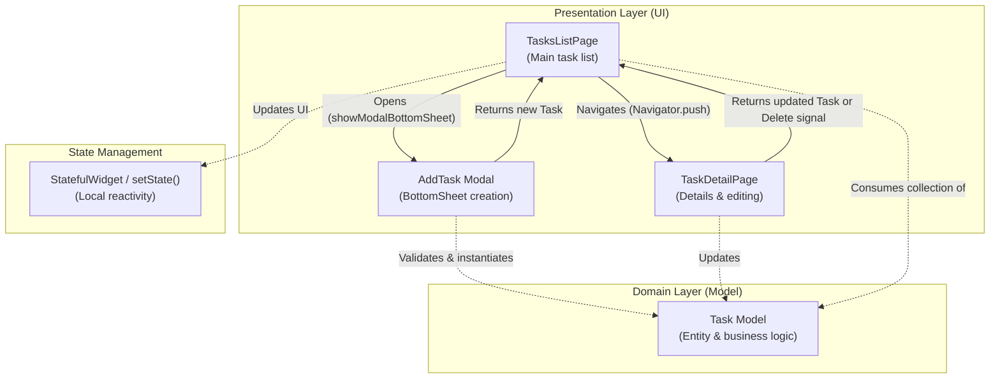

# Todo List App

[](https://flutter.dev/)
[](https://dart.dev/)
[](https://m3.material.io/)

> 🇧🇷 [**Português**](README.md) | 🇺🇸 **English Version**

Interactive daily task management application built with Flutter, focusing on practical form implementation with validation, cross-screen navigation with data returns, and a modular component architecture.

## 📌 Quick Navigation

- [📝 About the Project](#-about-the-project)
- [🖼️ Preview](#️-preview)
- [✨ Key Features](#-key-features)
- [🛠️ Technologies and Tools](#️-technologies-and-tools)
- [🏛️ Solution Architecture](#️-solution-architecture)
- [📁 Repository Structure](#-repository-structure)
- [💡 Technical Decisions](#-technical-decisions)
- [🚀 Getting Started](#-getting-started)

## 📝 About the Project

The **Todo List App** was developed as part of practical studies on forms and navigation in Flutter. The application provides an intuitive and responsive experience for organizing day-to-day tasks, allowing users to create, edit, prioritize, complete, and delete items with real-time validation and smooth transitions.

## 🖼️ Preview



## ✨ Key Features

- ➕ **Task Creation via Modal Bottom Sheet**: Quickly add new tasks with title, optional description, and initial importance flag without leaving the main view.
- ✅ **Status & Completion Toggle**: Interactive checkbox allowing instant status toggling directly in the list.
- ⭐ **Priority Pinning (Favorites/Important)**: Highlight key tasks with visual star indicators and instant feedback.
- ✏️ **Task Details & Editing**: Dedicated screen displaying creation date formatted in Brazilian Portuguese (`pt_BR`), title/description edits, and removal options.
- 🗑️ **Task Deletion**: Safe removal with callback response and automated list refresh.
- 🛡️ **Form Validation**: Prevent empty entries using Flutter's `Form` widget and `GlobalKey<FormState>`.

## 🛠️ Technologies and Tools

| Layer / Purpose | Technology | Description |
| :--- | :--- | :--- |
| **Primary Language** | **Dart 3.10+** | Static typing, null-safety, and object-oriented methods |
| **UI Framework** | **Flutter 3.x** | Multiplatform development with high-performance rendering engine |
| **Design System** | **Material Design 3** | Modern theming using `ColorScheme.fromSeed` and custom page transitions |
| **Internationalization / Formatting** | **intl (^0.20.2)** | Localized date formatting for pt-BR (`DateFormat.MMMEd`) |
| **System Icons** | **Cupertino Icons (^1.0.8)** | Standardized mobile icon set support |
| **Linter & Code Quality** | **flutter_lints (^6.0.0)** | Static code analysis adhering to Flutter community best practices |

## 🏛️ Solution Architecture

The application adopts a clean, layered architecture separating domain models, user interfaces, and input widgets:



## 📁 Repository Structure

```text
todo_list/
├── android/                   # Android native platform configuration
├── ios/                       # iOS native platform configuration
├── assets/
│   └── images/
│       └── todolist-gif.gif   # Visual animated demonstration
├── lib/
│   ├── models/
│   │   └── task.model.dart    # Task entity and state change methods
│   ├── pages/
│   │   ├── task_detail.page.dart # Detail, editing, and deletion page
│   │   └── tasks_list.page.dart  # Main listing page
│   ├── widgets/
│   │   └── add_task.widget.dart  # Quick task creation bottom sheet
│   └── main.dart              # Entry point and theme configuration
├── pubspec.yaml               # Dependency and metadata manager
└── README.md                  # Project documentation (Portuguese)
```

## 💡 Technical Decisions

- **Declarative Forms & Validation**: Implementation of `Form` with `GlobalKey<FormState>` to enforce required field checks on `TextFormField` before emitting new state objects.
- **Bidirectional Data Navigation**: Leveraging asynchronous navigation (`Navigator.push` and `showModalBottomSheet` with `async/await`) to seamlessly pass and receive updated task entities or removal events without coupling.
- **Localized Date Formatting**: App-level initialization via `initializeDateFormatting("pt_BR")` in `main.dart` enabling localized date strings with the `intl` package.
- **Enhanced User Experience (UX/UI)**: Dynamic keyboard viewport insets handling via `MediaQuery.of(context).viewInsets.bottom` and animated page transitions with `ZoomPageTransitionsBuilder`.

## 🚀 Getting Started

### Prerequisites
- [Flutter SDK](https://docs.flutter.dev/get-started/install) installed (compatible with Dart 3.10+).
- Configured Android/iOS emulator or connected physical device with USB debugging enabled.

### Step-by-Step Guide

1. **Clone the repository:**
   ```bash
   git clone https://github.com/ludson96/mobile-w-flutter.git
   ```

2. **Navigate to the project directory:**
   ```bash
   cd mobile-w-flutter/4-formularios-e-navegacoes/todo_list
   ```

3. **Install dependencies:**
   ```bash
   flutter pub get
   ```

4. **Run the application:**
   ```bash
   flutter run
   ```

<div align="center">
  Developed by <strong>Ludson Pereira dos Santos</strong> 🚀<br />
  <a href="https://www.linkedin.com/in/ludson96/">LinkedIn</a> • <a href="https://github.com/ludson96">GitHub</a> • <a href="mailto:ludson_ps27@hotmail.com">E-mail</a>
</div>
