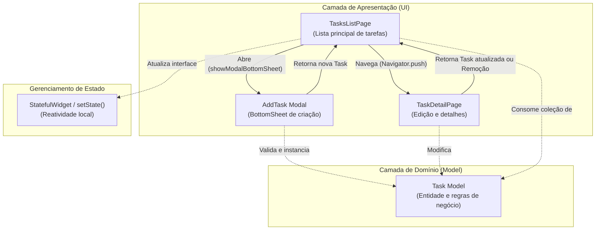

# Todo List App

[](https://flutter.dev/)
[](https://dart.dev/)
[](https://m3.material.io/)

> 🇧🇷 **Português** | 🇺🇸 [**English Version**](README.en.md)

Aplicativo interativo de gerenciamento de tarefas diárias desenvolvido em Flutter, com foco prático na construção de formulários com validações, navegação entre telas com retorno de dados e arquitetura modular de componentes.

## 📌 Navegação Rápida

- [📝 Sobre o Projeto](#-sobre-o-projeto)
- [🖼️ Preview](#️-preview)
- [✨ Funcionalidades](#-funcionalidades)
- [🛠️ Tecnologias e Ferramentas Utilizadas](#️-tecnologias-e-ferramentas-utilizadas)
- [🏛️ Arquitetura da Solução](#️-arquitetura-da-solução)
- [📁 Estrutura do Repositório](#-estrutura-do-repositório)
- [💡 Decisões Técnicas](#-decisões-técnicas)
- [🚀 Como Executar o Projeto](#-como-executar-o-projeto)

## 📝 Sobre o Projeto

O **Todo List App** foi desenvolvido como parte dos estudos práticos do módulo de formulários e navegações em Flutter. A aplicação entrega uma experiência fluida para organização de afazeres, permitindo a criação, edição, marcação de prioridade, conclusão e exclusão de itens de forma reativa e com validação de dados em tempo real.

## 🖼️ Preview


## ✨ Funcionalidades

- ➕ **Criação de Tarefas via Modal Bottom Sheet**: Adição rápida de tarefas com suporte a título, descrição opcional e marcação inicial de importância sem sair do fluxo principal.
- ✅ **Controle de Status e Conclusão**: Checkbox interativo para alternar o status da tarefa diretamente na listagem.
- ⭐ **Marcação de Prioridade (Favoritos/Importantes)**: Destaque visual imediato de tarefas prioritárias com feedback instantâneo.
- ✏️ **Edição e Detalhes da Tarefa**: Navegação dedicada para visualização de data de criação formatada em português brasileiro (`pt_BR`), alteração de título/descrição e exclusão.
- 🗑️ **Exclusão de Tarefas**: Remoção com retorno de estado e atualização automática da listagem.
- 🛡️ **Validação de Formulários**: Bloqueio de submissão de campos vazios utilizando `Form` e `GlobalKey<FormState>`.

## 🛠️ Tecnologias e Ferramentas Utilizadas

| Camada / Finalidade | Tecnologia | Descrição |
| :--- | :--- | :--- |
| **Linguagem Principal** | **Dart 3.10+** | Tipagem estática, null-safety e métodos orientados a objetos |
| **Framework de UI** | **Flutter 3.x** | Desenvolvimento multiplataforma com renderização de alta performance |
| **Design System** | **Material Design 3** | Tematização moderna com `ColorScheme.fromSeed` e transições customizadas |
| **Internacionalização / Formatação** | **intl (^0.20.2)** | Formatação localizada de datas no padrão pt-BR (`DateFormat.MMMEd`) |
| **Ícones do Sistema** | **Cupertino Icons (^1.0.8)** | Suporte a conjunto padronizado de ícones do ecossistema |
| **Linter e Boas Práticas** | **flutter_lints (^6.0.0)** | Análise estática de código e aderência às diretrizes da comunidade |

## 🏛️ Arquitetura da Solução

O projeto adota uma arquitetura em camadas orientada a responsabilidades, separando modelos de domínio, telas de visualização e componentes de entrada de dados:



## 📁 Estrutura do Repositório

```text
todo_list/
├── android/                   # Configurações nativas da plataforma Android
├── ios/                       # Configurações nativas da plataforma iOS
├── assets/
│   └── images/
│       └── todolist-gif.gif   # Demonstração visual do aplicativo
├── lib/
│   ├── models/
│   │   └── task.model.dart    # Entidade Task e métodos de alteração de estado
│   ├── pages/
│   │   ├── task_detail.page.dart # Tela de detalhes, edição e exclusão
│   │   └── tasks_list.page.dart  # Tela principal com listagem de tarefas
│   ├── widgets/
│   │   └── add_task.widget.dart  # Modal de criação rápida de tarefas
│   └── main.dart              # Ponto de entrada e configuração do tema
├── pubspec.yaml               # Gerenciador de dependências e metadados
└── README.md                  # Documentação do projeto
```

## 💡 Decisões Técnicas

- **Formulários e Validação Declarativa**: Uso de `Form` combinado com `GlobalKey<FormState>` para controle e validação de campos obrigatórios (`TextFormField`), garantindo integridade de dados antes de propagar estados.
- **Navegação com Retorno de Dados Bidirecional**: Aproveitamento do fluxo assíncrono do `Navigator.push` e `showModalBottomSheet` (`async/await`) para receber entidades atualizadas ou sinais de remoção sem necessidade de acoplamento excessivo.
- **Formatação de Data Localizada**: Inicialização do `initializeDateFormatting("pt_BR")` na inicialização do app (`main.dart`), viabilizando a exibição amigável de datas no padrão brasileiro com o pacote `intl`.
- **Experiência do Usuário (UX/UI)**: Ajuste dinâmico de teclado no modal de criação via `MediaQuery.of(context).viewInsets.bottom` e transições suaves com `ZoomPageTransitionsBuilder`.

## 🚀 Como Executar o Projeto

### Pré-requisitos
- [Flutter SDK](https://docs.flutter.dev/get-started/install) instalado (versão compatível com Dart 3.10+).
- Emulador Android / iOS configurado ou dispositivo físico conectado com depuração USB habilitada.

### Passo a Passo

1. **Clone o repositório:**
   ```bash
   git clone https://github.com/ludson96/mobile-w-flutter.git
   ```

2. **Acesse o diretório do projeto:**
   ```bash
   cd mobile-w-flutter/4-formularios-e-navegacoes/todo_list
   ```

3. **Obtenha as dependências:**
   ```bash
   flutter pub get
   ```

4. **Execute a aplicação:**
   ```bash
   flutter run
   ```

<div align="center">
  Desenvolvido por <strong>Ludson Pereira dos Santos</strong> 🚀<br />
  <a href="https://www.linkedin.com/in/ludson96/">LinkedIn</a> • <a href="https://github.com/ludson96">GitHub</a> • <a href="mailto:ludson_ps27@hotmail.com">E-mail</a>
</div>
