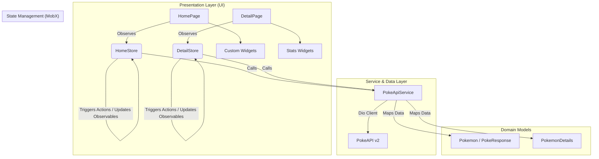

# Pokédex App

[](https://dart.dev/)
[](https://flutter.dev/)
[](https://pub.dev/packages/mobx)
[](https://pub.dev/packages/dio)

> 🇧🇷 [**Português**](README.md) | 🇺🇸 **English Version**

A modern, high-performance, and interactive mobile application built with Flutter to explore the Pokémon universe, browse detailed information, search by name/number, and visualize complete stats in real time.

## 📌 Quick Navigation

- [📝 About the Project](#-about-the-project)
- [🖼️ Preview](#️-preview)
- [⚡ API Endpoints](#-api-endpoints)
- [✨ Features](#-features)
- [🛠️ Technologies & Tools Used](#️-technologies--tools-used)
- [🏛️ Solution Architecture](#️-solution-architecture)
- [📁 Repository Structure](#-repository-structure)
- [💡 Technical Decisions](#-technical-decisions)
- [🚀 How to Run the Project](#-how-to-run-the-project)

## 📝 About the Project

The **Pokédex App** is a mobile application developed to showcase robust REST API integration, optimized asynchronous data consumption, and smooth UI animations within the **Flutter** ecosystem.

The application consumes the [PokeAPI v2](https://pokeapi.co/), leveraging incremental pagination (*Infinite Scroll*), predictable and reactive state management with **MobX**, smart image caching, and dynamic color extraction based on each Pokémon sprite to enhance the visual experience.

## 🖼️ Preview


## ⚡ API Endpoints

The application consumes the public REST API from [PokeAPI](https://pokeapi.co/api/v2) through the centralized `PokeApiService`:

| Method | Endpoint | Description |
| :--- | :--- | :--- |
| `GET` | `/pokemon?offset={offset}&limit=20` | Paginated Pokémon list for infinite feed scrolling |
| `GET` | `/pokemon/{nameOrId}` | Full Pokémon details (types, stats, abilities, height, weight, and sprites) |

## ✨ Features

- 🔍 **Real-Time Search:** Instant filtering by Pokémon name or number (ID).
- 📜 **Infinite Scroll:** On-demand pagination as the user scrolls through the list.
- 🎨 **Dynamic Colors:** Automatic dominant color extraction from sprites for custom card theming.
- 📊 **Detailed Statistics:** Visual stat indicators (HP, Attack, Defense, Speed, etc.) using animated progress bars.
- 🖼️ **Smart Image Caching:** Network image caching in memory/disk to optimize bandwidth and rendering speed.
- ⚡ **MobX Reactivity:** Fine-grained UI updates with observables, actions, and computed properties.

## 🛠️ Technologies & Tools Used

| Layer / Purpose | Technology | Description |
| :--- | :--- | :--- |
| **Primary Language** | **Dart ^3.10.7** | Strongly-typed, strict null safety, and asynchronous features |
| **Mobile Framework** | **Flutter 3.x** | High-performance declarative cross-platform UI toolkit |
| **State Management** | **MobX & flutter_mobx** | Transparent and reactive state management with code generation (`mobx_codegen`) |
| **HTTP Client** | **Dio ^5.9.1** | HTTP client supporting base URLs, timeouts, and custom request configurations |
| **Color Extraction** | **palette_generator_master** | Runtime image palette processing for dynamic dominant colors |
| **Visual Components** | **percent_indicator** | Linear and circular progress indicators for Pokémon stats |
| **Image Management** | **cached_network_image** | Network image downloading, disk/memory caching, and placeholders |
| **Code Generation** | **build_runner** | Build pipeline for automatic MobX stores generation (`*.g.dart`) |
| **Code Quality** | **flutter_lints** | Static analysis and official Flutter linting conventions |

## 🏛️ Solution Architecture

The project follows a modular, feature-based architecture with clear separation of concerns:



## 📁 Repository Structure

```text
pokedex/
├── assets/
│   └── images/                     # Visual assets and demo media
├── lib/
│   ├── models/                     # Data models and JSON/Map parsers
│   │   ├── poke_response.model.dart
│   │   ├── pokemon_details.model.dart
│   │   └── pokemon.model.dart
│   ├── pages/                      # Feature-oriented screen modules
│   │   ├── details/                # Pokémon detail screen
│   │   │   ├── stores/             # Detail screen MobX store
│   │   │   ├── widgets/            # Detail-specific UI components
│   │   │   └── detail.page.dart
│   │   └── home/                   # Main list screen
│   │       ├── stores/             # Home MobX store with pagination and search
│   │       ├── widgets/            # Cards, list items, and search inputs
│   │       └── home.page.dart
│   ├── services/                   # Remote API services and HTTP client
│   │   └── poke_api.services.dart
│   ├── colors.dart                 # Color tokens and constants
│   └── main.dart                   # Flutter app entry point
├── pubspec.yaml                    # Dependencies and assets manifest
└── analysis_options.yaml           # Linter rules and options
```

## 💡 Technical Decisions

- **MobX for State Management:** Chosen for its high reactivity and ergonomic observable tracking with minimal event boilerplate, clearly separating UI from business logic.
- **Dio as HTTP Client:** Simplifies base URL management, network error handling, and asynchronous API calls.
- **Palette Generator for Contextual UI:** Dynamic extraction of dominant sprite colors creates an immersive, tailored aesthetic for each creature.
- **ScrollController with Pagination:** Incrementally fetches Pokémon via offsets to minimize device memory footprint and network load.
- **CachedNetworkImage:** Prevents repeated network downloads during scrolling, maintaining a consistent 60/120 FPS frame rate.

## 🚀 How to Run the Project

### Prerequisites
- [Flutter SDK](https://flutter.dev/docs/get-started/install) installed (version 3.x recommended)
- [Dart SDK](https://dart.dev/get-dart) (^3.10.7)
- Android / iOS emulator or a physical device connected

### Step by Step

1. **Clone the repository:**
   ```bash
   git clone https://github.com/ludson96/mobile-w-flutter.git
   cd mobile-w-flutter/6-animacoes-e-integracao-w-api/pokedex
   ```

2. **Install dependencies:**
   ```bash
   flutter pub get
   ```

3. **Generate MobX code files (if needed):**
   ```bash
   dart run build_runner build --delete-conflicting-outputs
   ```

4. **Launch the application:**
   ```bash
   flutter run
   ```

<div align="center">
  Developed by <strong>Ludson Pereira dos Santos</strong> 🚀<br />
  <a href="https://www.linkedin.com/in/ludson96/">LinkedIn</a> • <a href="https://github.com/ludson96">GitHub</a> • <a href="mailto:ludson_ps27@hotmail.com">E-mail</a>
</div>
