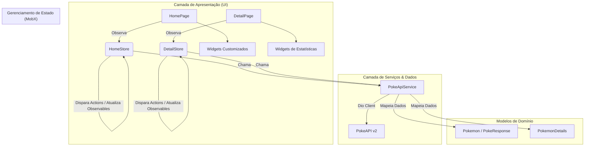

# Pokédex App

[](https://dart.dev/)
[](https://flutter.dev/)
[](https://pub.dev/packages/mobx)
[](https://pub.dev/packages/dio)

> 🇧🇷 **Português** | 🇺🇸 [**English Version**](README.en.md)

Uma aplicação mobile moderna, performática e interativa desenvolvida em Flutter para explorar o universo Pokémon, consultar informações detalhadas, buscar por nome/número e visualizar atributos e estatísticas completas em tempo real.

## 📌 Navegação Rápida

- [📝 Sobre o Projeto](#-sobre-o-projeto)
- [🖼️ Preview](#️-preview)
- [⚡ API Endpoints](#-api-endpoints)
- [✨ Funcionalidades](#-funcionalidades)
- [🛠️ Tecnologias e Ferramentas Utilizadas](#️-tecnologias-e-ferramentas-utilizadas)
- [🏛️ Arquitetura da Solução](#️-arquitetura-da-solução)
- [📁 Estrutura do Repositório](#-estrutura-do-repositório)
- [💡 Decisões Técnicas](#-decisões-técnicas)
- [🚀 Como Executar o Projeto](#-como-executar-o-projeto)

## 📝 Sobre o Projeto

O **Pokédex App** é um aplicativo mobile desenvolvido para demonstrar integração robusta de APIs REST, consumo otimizado de dados assíncronos e criação de interfaces fluidas com animações dinâmicas no ecossistema **Flutter**.

O projeto consome a [PokeAPI v2](https://pokeapi.co/), aplicando paginação incremental (*Infinite Scroll*), gerenciamento de estado reativo e previsível com **MobX**, cache eficiente de imagens remotas e extração dinâmica da paleta de cores dominante de cada Pokémon para enriquecer a experiência visual.

## 🖼️ Preview


## ⚡ API Endpoints

A aplicação consome a API REST pública da [PokeAPI](https://pokeapi.co/api/v2) por meio do serviço centralizado `PokeApiService`:

| Método | Endpoint | Descrição |
| :--- | :--- | :--- |
| `GET` | `/pokemon?offset={offset}&limit=20` | Lista paginada de Pokémons para o feed infinito |
| `GET` | `/pokemon/{nameOrId}` | Detalhes completos do Pokémon (tipos, status, habilidades, altura, peso e sprites) |

## ✨ Funcionalidades

- 🔍 **Busca em Tempo Real:** Filtragem dinâmica e instantânea por nome ou número (ID) do Pokémon.
- 📜 **Infinite Scroll:** Paginação e carregamento sob demanda conforme o usuário navega pela lista.
- 🎨 **Cores Dinâmicas:** Identificação e extração da cor predominante de cada sprite para estilização personalizada do card.
- 📊 **Estatísticas Detalhadas:** Visualização gráfica de status (HP, Ataque, Defesa, Velocidade, etc.) com barras de progresso animadas.
- 🖼️ **Cache Inteligente de Imagens:** Otimização de performance e consumo de banda com cache de imagens em rede.
- ⚡ **Reatividade com MobX:** Atualizações de interface granulares e automáticas com observables, actions e computeds.

## 🛠️ Tecnologias e Ferramentas Utilizadas

| Camada / Finalidade | Tecnologia | Descrição |
| :--- | :--- | :--- |
| **Linguagem Principal** | **Dart ^3.10.7** | Tipagem estática, null safety estrito e recursos assíncronos |
| **Framework Mobile** | **Flutter 3.x** | Construção de UI declarativa, multiplataforma e de alta performance |
| **Gerenciamento de Estado** | **MobX & flutter_mobx** | Gestão de estado reativa e transparente com geração de código (`mobx_codegen`) |
| **Cliente HTTP** | **Dio ^5.9.1** | Requisições HTTP com suporte a interceptors, timeouts e configuração base |
| **Extração de Cores** | **palette_generator_master** | Processamento de imagens em runtime para extrair paletas e cores dominantes |
| **Componentes Visuais** | **percent_indicator** | Renderização de barras lineares e visuais para estatísticas |
| **Gerenciamento de Imagens** | **cached_network_image** | Download, cache em disco/memória e placeholders para imagens remotas |
| **Geração de Código** | **build_runner** | Pipeline para geração automática de stores MobX (`*.g.dart`) |
| **Padronização de Código** | **flutter_lints** | Regras de análise estática e boas práticas recomendadas da comunidade |

## 🏛️ Arquitetura da Solução

O projeto segue uma arquitetura modular orientada a features e responsabilidades bem delineadas:



## 📁 Estrutura do Repositório

```text
pokedex/
├── assets/
│   └── images/                     # Recursos visuais e demonstrações
├── lib/
│   ├── models/                     # Modelos de dados e parsers (JSON / Map)
│   │   ├── poke_response.model.dart
│   │   ├── pokemon_details.model.dart
│   │   └── pokemon.model.dart
│   ├── pages/                      # Módulos de telas por funcionalidade
│   │   ├── details/                # Tela de detalhes do Pokémon
│   │   │   ├── stores/             # Store MobX da tela de detalhes
│   │   │   ├── widgets/            # Componentes específicos de detalhes
│   │   │   └── detail.page.dart
│   │   └── home/                   # Tela principal / listagem
│   │       ├── stores/             # Store MobX da listagem com paginação e busca
│   │       ├── widgets/            # Cards, list items e busca
│   │       └── home.page.dart
│   ├── services/                   # Clientes e serviços de API externa
│   │   └── poke_api.services.dart
│   ├── colors.dart                 # Constantes e tokens de cores
│   └── main.dart                   # Ponto de entrada da aplicação Flutter
├── pubspec.yaml                    # Declaração de dependências e assets
└── analysis_options.yaml           # Configurações de linter
```

## 💡 Decisões Técnicas

- **MobX para Gerenciamento de Estado:** Escolhido pela alta reatividade e ergonomia no rastreamento de mutações de estado sem boilerplates excessivos de eventos, separando visualização de regras de negócio.
- **Dio como HTTP Client:** Facilita a configuração centralizada de base URL, tratamento padronizado de status HTTP e controle de requisições assíncronas.
- **Palette Generator para UI Contextual:** A extração dinâmica da cor predominante de cada sprite oferece um design imersivo e adaptativo para cada criatura.
- **ScrollController com Paginação:** A listagem consome a API de forma incremental com offsets, minimizando uso de memória e tráfego de dados.
- **CachedNetworkImage:** Evita downloads redundantes da mesma sprite na rolagem da lista, garantindo fluidez a 60/120 FPS.

## 🚀 Como Executar o Projeto

### Pré-requisitos
- [Flutter SDK](https://flutter.dev/docs/get-started/install) instalado (versão 3.x recomendada)
- [Dart SDK](https://dart.dev/get-dart) (^3.10.7)
- Emulador Android / iOS ou dispositivo físico configurado

### Passo a Passo

1. **Clone o repositório:**
   ```bash
   git clone https://github.com/ludson96/mobile-w-flutter.git
   cd mobile-w-flutter/6-animacoes-e-integracao-w-api/pokedex
   ```

2. **Obtenha as dependências:**
   ```bash
   flutter pub get
   ```

3. **Gere os arquivos de código MobX (se necessário):**
   ```bash
   dart run build_runner build --delete-conflicting-outputs
   ```

4. **Inicie o aplicativo:**
   ```bash
   flutter run
   ```

<div align="center">
  Desenvolvido por <strong>Ludson Pereira dos Santos</strong> 🚀<br />
  <a href="https://www.linkedin.com/in/ludson96/">LinkedIn</a> • <a href="https://github.com/ludson96">GitHub</a> • <a href="mailto:ludson_ps27@hotmail.com">E-mail</a>
</div>
